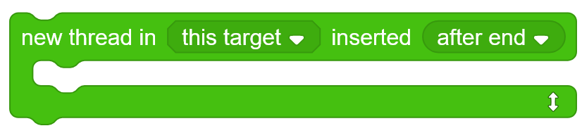
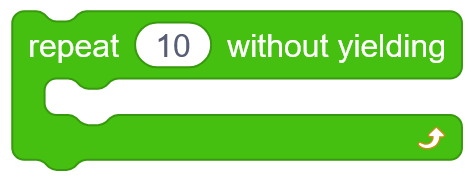
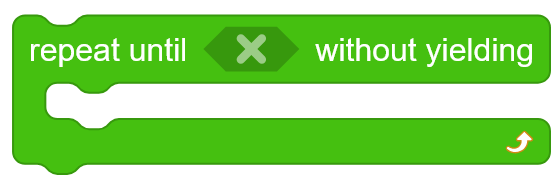
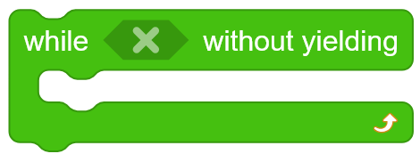
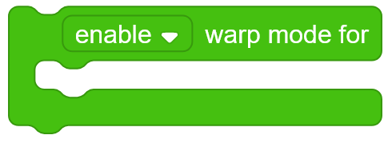

# Reference Manual

### Table of Contents
- [Blocks](#blocks)
  - [Thread Getters](#thread-getters)
    - [`(active thread)` -> Thread](#codeactive-threadcode--gt-thread)
    - [`(active index)` -> Number](#codeactive-indexcode--gt-number)
    - [`(null thread)` -> Thread](#codenull-threadcode--gt-thread)
    - [`(thread at (INDEX v))` -> Thread](#codethread-at-index-vcode--gt-thread)
  - [Thread Builders](#thread-builders)
    - [`new thread in (TARGET v) inserted (INDEX v) {SUBSTACK}` -> Undefined](#codenew-thread-in-target-v-inserted-index-v-substackcode--gt-undefined)
    - [`(new thread in (TARGET v) inserted (INDEX v) {SUBSTACK})` -> Thread](#codenew-thread-in-target-v-inserted-index-v-substackcode--gt-thread)
  - [Thread Properties](#thread-properties)
    - [`(target of [THREAD])` -> Target](#codetarget-of-threadcode--gt-target)
    - [`(id of [THREAD])` -> String](#codeid-of-threadcode--gt-string)
    - [`(index of [THREAD])` -> Number](#codeindex-of-threadcode--gt-number)
    - [`(status [STATUSFORMAT v] of [THREAD])` -> Number | String](#codestatus-statusformat-v-of-threadcode--gt-number--string)
    - [`(unpaused status [STATUSFORMAT v] of [THREAD])` -> Number | String](#codeunpaused-status-statusformat-v-of-threadcode--gt-number--string)
    - [`(info text of [THREAD])` -> String](#codeinfo-text-of-threadcode--gt-string)
  - [Thread Variables](#thread-variables)
    - [`(get [VARIABLE] in [THREAD])` -> Any](#codeget-variable-in-threadcode--gt-any)
    - [`set [VARIABLE] in [THREAD] to [VALUE]` -> Undefined](#codeset-variable-in-thread-to-valuecode--gt-undefined)
    - [`(variables in [THREAD])` -> Array\[String\]](#codevariables-in-threadcode--gt-arraystring)
    - [`delete [VARIABLE] in [THREAD]` -> Undefined](#codedelete-variable-in-threadcode--gt-undefined)
  - [Boolean Thread Operators](#boolean-thread-operators)
    - [`<[VALUE] is a thread?>` -> Boolean](#codeltvalue-is-a-threadgtcode--gt-boolean)
    - [`<[THREADONE] is [THREADTWO]>` -> Boolean](#codeltthreadone-is-threadtwogtcode--gt-boolean)
    - [`<[THREAD] is null?>` -> Boolean](#codeltthread-is-nullgtcode--gt-boolean)
    - [`<[THREAD] is alive?>` -> Boolean](#codeltthread-is-alivegtcode--gt-boolean)
    - [`<[THREAD] exited naturally?>` -> Boolean](#codeltthread-exited-naturallygtcode--gt-boolean)
    - [`<[THREAD] was killed?>` -> Boolean](#codeltthread-was-killedgtcode--gt-boolean)
    - [`<[THREAD] was paused manually?>` -> Boolean](#codeltthread-was-paused-manuallygtcode--gt-boolean)
    - [`<[THREAD] is in limbo?>` -> Boolean](#codeltthread-is-in-limbogtcode--gt-boolean)
    - [`<[THREAD] is orphaned?>` -> Boolean](#codeltthread-is-orphanedgtcode--gt-boolean)
    - [`<[THREAD] is a monitor updater?>` -> Boolean](#codeltthread-is-a-monitor-updatergtcode--gt-boolean)
    - [`<[THREAD] is an executable hat thread?>` -> Boolean](#codeltthread-is-an-executable-hat-threadgtcode--gt-boolean)
    - [`<[THREAD] was started by clicking in the editor?>` -> Boolean](#codeltthread-was-started-by-clicking-in-the-editorgtcode--gt-boolean)
  - [Thread Actions](#thread-actions)
    - [`kill [THREAD]` -> Undefined](#codekill-threadcode--gt-undefined)
    - [`pause [THREAD]` -> Undefined](#codepause-threadcode--gt-undefined)
    - [`unpause [THREAD]` -> Undefined](#codeunpause-threadcode--gt-undefined)
  - [Yielding](#yielding)
    - [`yield` -> Undefined](#codeyieldcode--gt-undefined)
    - [`yield [TIMES] times` -> Undefined](#codeyield-times-timescode--gt-undefined)
    - [`yield to previous thread` -> Undefined](#codeyield-to-previous-threadcode--gt-undefined)
    - [`yield to [ACTIVETHREAD]` -> Undefined](#codeyield-to-activethreadcode--gt-undefined)
    - [`yield to thread at (INDEX v)` -> Undefined](#codeyield-to-thread-at-index-vcode--gt-undefined)
    - [`yield to end of tick` -> Undefined](#codeyield-to-end-of-tickcode--gt-undefined)
  - [Broadcasts](#broadcasts)
    - [`broadcast [MESSAGE v] to (INDEX v)` -> Undefined](#codebroadcast-message-v-to-index-vcode--gt-undefined)
    - [`broadcast [MESSAGE v] to (INDEX v) and wait` -> Undefined](#codebroadcast-message-v-to-index-v-and-waitcode--gt-undefined)
    - [`step [MESSAGE v] immediately and return` -> Undefined](#codestep-message-v-immediately-and-returncode--gt-undefined)
    - [`(last broadcast threads)` -> Array\[Thread\]](#codelast-broadcast-threadscode--gt-arraythread)
    - [`(first thread from last broadcast)` -> Thread](#codefirst-thread-from-last-broadcastcode--gt-thread)
  - [Threads Array](#threads-array)
    - [`(threads)` -> Array\[Thread\]](#codethreadscode--gt-arraythread)
    - [`(threads in (TARGET v))` -> Array\[Thread\]](#codethreads-in-target-vcode--gt-arraythread)
    - [`set threads to [THREADS] and yield to [ACTIVETHREAD]` -> Undefined](#codeset-threads-to-threads-and-yield-to-activethreadcode--gt-undefined)
    - [`set threads to [THREADS] and yield to thread at (ACTIVEINDEX v)` -> Undefined](#codeset-threads-to-threads-and-yield-to-thread-at-activeindex-vcode--gt-undefined)
    - [`move [THREAD] to (INDEX v)` -> Undefined](#codemove-thread-to-index-vcode--gt-undefined)
    - [`swap [THREADONE] with [THREADTWO]` -> Undefined](#codeswap-threadone-with-threadtwocode--gt-undefined)
  - [Atomic Loops](#atomic-loops)
    - [`repeat [TIMES] without yielding {SUBSTACK}` -> Undefined](#coderepeat-times-without-yielding-substackcode--gt-undefined)
    - [`repeat until [CONDITION] without yielding {SUBSTACK}` -> Undefined](#coderepeat-until-condition-without-yielding-substackcode--gt-undefined)
    - [`while [CONDITION] without yielding {SUBSTACK}` -> Undefined](#codewhile-condition-without-yielding-substackcode--gt-undefined)
    - [`forever without yielding {SUBSTACK}` -> Undefined](#codeforever-without-yielding-substackcode--gt-undefined)
  - [Counters](#counters)
    - [`(tick # from init)` -> Number](#codetick--from-initcode--gt-number)
    - [`(frame # from init)` -> Number](#codeframe--from-initcode--gt-number)
    - [`(tick # from @blueFlag)` -> Number](#codetick--from-blueflagcode--gt-number)
    - [`(frame # from @blueFlag)` -> Number](#codeframe--from-blueflagcode--gt-number)
    - [`(tick # this frame)` -> Number](#codetick--this-framecode--gt-number)
  - [Runtime Phase](#runtime-phase)
    - [`<this is a predicate step?>` -> Boolean](#codeltthis-is-a-predicate-stepgtcode--gt-boolean)
    - [`(runtime phase [STATUSFORMAT v])` -> Number | String](#coderuntime-phase-statusformat-vcode--gt-number--string)
  - [Warp Mode](#warp-mode)
    - [`<warp mode>` -> Boolean](#codeltwarp-modegtcode--gt-boolean)
    - [`[SETBOOLEAN v] warp mode for {SUBSTACK}` -> Undefined](#codesetboolean-v-warp-mode-for-substackcode--gt-undefined)
  - [Graphics Updated](#codetarget-work-timecode--gt-number)
    - [`<graphics updated>` -> Boolean](#codetarget-work-timecode--gt-number---boolean)
    - [`set graphics updated to <VALUE>` -> Undefined](#codelast-measured-frame-timecode--gt-number)
  - [Timers](#codetarget-work-timecode--gt-number)
    - [`(target frame time)` -> Number](#codelast-measured-work-timecode--gt-number)
    - [`(last measured frame time)` -> Number](#codework-timercode--gt-number)
    - [`(target work time)` -> Number](#codeset-work-timer-to-timecode--gt-undefined)
    - [`(last measured work time)` -> Number](#graphics-updated)
    - [`(work timer)` -> Number](#codeltgraphics-updatedgtcode--gt-boolean)
    - [`set work timer to [TIME]` -> Undefined](#codeset-graphics-updated-to-ltvaluegtcode--gt-undefined)
- [Menus](#menus)
    - [Get Index](#get-index)
    - [Insert Index](#insert-index)
    - [Target](#target)
    - [Status Format](#status-format)
    - [Set Boolean](#set-boolean)

# Blocks

## Thread Getters

### `(active thread)` -> Thread

Returns the current thread.

  
Internal behavior

  
  Reads the `thread` global in the compiled context.

  **Note:** This used to read `sequencer.activeThread`, but this is `null` during [predicate steps](#codeltthis-is-a-predicate-stepgtcode--gt-boolean), so it was changed.

### `(active index)` -> Number

Returns the index of the [current thread](#codeactive-threadcode--gt-thread) in the [threads array](#codethreadscode--gt-arraythread), or the last index of the current thread if the current thread is [orphaned](#codeltthread-is-orphanedgtcode--gt-boolean).

If both this is a [predicate step](#codeltthis-is-a-predicate-stepgtcode--gt-boolean) and the current thread is orphaned, returns an empty string.

  
Internal behavior

  
  Reads `sequencer.activeThreadIndex` _([I added that!↗](https://github.com/PenguinMod/PenguinMod-Vm/pull/173) :D)_, or if this is a [predicate step](#codeltthis-is-a-predicate-stepgtcode--gt-boolean), finds the index of the `thread` compiled global in `runtime.threads`. If the `thread` compiled global is not in `runtime.threads`, returns an empty string.

### `(null thread)` -> Thread

Returns the null thread.

This represents a thread that failed to load or doesn't exist. It has an ID of `undefined`. This thread is also used when the wrong type is inserted into a thread input.

### `(thread at (INDEX v))` -> Thread
_Menus: `INDEX` uses [Get Index](#get-index)_

Returns the thread that is at `INDEX` in the [threads array](#codethreadscode--gt-arraythread).

  
Internal behavior

  
  Reads from the `runtime.threads` array.

## Thread Builders

### `new thread in (TARGET v) inserted (INDEX v) {SUBSTACK}` -> Undefined
_Menus: `TARGET` uses [Target](#target), `INDEX` uses [Insert Index](#insert-index)_

Creates a new thread that will execute in `TARGET`; then, inserts it into the [threads array](#codethreadscode--gt-arraythread) at `INDEX`.


Local ("For this sprite only") variables have noteworthy behavior when used inside `SUBSTACK` where `TARGET` is not the current target:
- If it exists, the variable with the same name in `TARGET` is used.
- If no variable with the same name exists in `TARGET`, **a new local variable will be created** in `TARGET` with the name, but this variable will have the same ID as the variable in the original sprite. This can cause odd behavior and/or bugs with variable monitors due to ID conflict.



  
Internal behavior

  
  Uses `runtime._pushThread` to create a new thread at the end of the [threads array](#codethreadscode--gt-arraythread) containing the contents of `SUBSTACK`. Next, moves it to `INDEX`. Finally, updates `sequencer.activeThreadIndex` if the active thread was moved.

  If this is a [predicate step](#codeltthis-is-a-predicate-stepgtcode--gt-boolean), `sequencer.activeThreadIndex` is actually left unchanged, as we are not currently in the [execution phase](#coderuntime-phase-statusformat-vcode--gt-number--string), so it is `null`.

  The new thread is created by passing the ID of the first block in `SUBSTACK` to `runtime._pushThread`, rather than by starting some precompiled chunk. This means that **`SUBSTACK` is not compiled until the "new thread" block is run**.

### `(new thread in (TARGET v) inserted (INDEX v) {SUBSTACK})` -> Thread
_Menus: `TARGET` uses [Target](#target), `INDEX` uses [Insert Index](#insert-index)_

Same as [`new thread in (TARGET v) inserted (INDEX v) {SUBSTACK}`](#codenew-thread-in-target-v-inserted-index-v-substackcode--gt-undefined), except returns the thread that was created (or null).

Will return the null thread if there are no blocks in `SUBSTACK` or if `TARGET` is invalid.

## Thread Properties

### `(target of [THREAD])` -> Target

Returns the target that is running / ran `THREAD`.

  
Internal behavior

  
  Reads the `target` key from the raw thread object.

### `(id of [THREAD])` -> String

Returns a unique identifier for `THREAD`. This ID is generated by the extension and is not used in the PenguinMod engine.

  
Internal behavior

  
  Reads the custom `soupThreadId` key from the raw thread object.

### `(index of [THREAD])` -> Number

Returns the index of `THREAD` in the [list of threads](#codethreadscode--gt-arraythread).

  
Internal behavior

  
  Finds the index of the thread in the `runtime.threads` array.

### `(status [STATUSFORMAT v] of [THREAD])` -> Number | String
_Menus: `STATUSFORMAT` uses [Status Format](#status-format)_

Returns the current status code of `THREAD`, formatted as specified by `STATUSFORMAT`. These are the possible values:

| Status # | Status text          | Internal name         | Description                                                                                                                                         |
|----------|----------------------|-----------------------|-----------------------------------------------------------------------------------------------------------------------------------------------------|
| 0        | Running              | `STATUS_RUNNING`      | The default status of a thread.[^1]                                                                                                                 |
| 1        | Waiting for promise  | `STATUS_PROMISE_WAIT` | An asynchronous block's [`Promise`↗](https://developer.mozilla.org/en-US/docs/Web/JavaScript/Reference/Global_Objects/Promise) is pending, so the thread will be skipped. When the `Promise` fulfills or rejects, the status is set to `STATUS_RUNNING`. This can happen at any time. (Note[^13] about this entire description). |
| 2        | Yielded              | `STATUS_YIELD`        | Only used when the compiler is disabled; disabling the compiler is a deprecated feature.                                                            |
| 3        | Waiting for frame    | `STATUS_YIELD_TICK`   | The thread is waiting for the next frame and will be skipped. When a thread with this status is about to be considered (potentially stepped), if it is the first tick of the frame, its status is set to `STATUS_RUNNING`. This stops the thread from being skipped and allows it to step. |
| 4        | Completed            | `STATUS_DONE`         | The thread is "dead", i.e. it will never run code again.[^1]                                                                                        |
| 5        | Paused               | `STATUS_PAUSED`       | The thread is paused either from the [`pause [THREAD]`](#codepause-threadcode--gt-undefined) block, the  button, or another source, and will be skipped. |

  
Internal behavior

  
  Reads the `status` key from the raw thread object.

### `(unpaused status [STATUSFORMAT v] of [THREAD])` -> Number | String
_Menus: `STATUSFORMAT` uses [Status Format](#status-format)_

Same as [`(status [STATUSFORMAT v] of [THREAD])`](#codestatus-statusformat-v-of-threadcode--gt-number--string), except if `THREAD` is paused, returns the status that the thread had _before_ it was paused.

  
Internal behavior

  
  Reads the `status` key from the raw thread object, or if it is [5 (paused)](#codestatus-statusformat-v-of-threadcode--gt-number--string), instead reads the `originalStatus` key.

### `(info text of [THREAD])` -> String

Returns user-friendly info text for the thread as shown in the reporter bubble.[^11]

## Thread Variables


The variable name `__label__` is special. If this variable exists in a thread, that thread's reporter bubble will show the stringified contents of it italicised next to other info. This is meant to be used to add human-readable identifiers or notes to a thread, which will then be seen in the editor or when debugging.

Other than visuals in the editor, this variable can be used entirely as a normal variable, and even hold non-string types; however this is not recommended.



### `(get [VARIABLE] in [THREAD])` -> Any

Gets the thread variable named `VARIABLE` from `THREAD`. These thread variables are unique to this extension and are not used by the PenguinMod engine.

The null thread cannot store thread variables.

  
Internal behavior

  Gets the `VARIABLE` key from the object at the `soupThreadVariables` key of the raw thread.

### `set [VARIABLE] in [THREAD] to [VALUE]` -> Undefined

Sets the [thread variable](#codeget-variable-in-threadcode--gt-any) named `VARIABLE` in `THREAD` to `VALUE`.

  
Internal behavior

  Sets the `VARIABLE` key to `VALUE` in the object at the `soupThreadVariables` key of the raw thread.

### `(variables in [THREAD])` -> Array\[String\]

Returns an array containing the name of every [thread variable](#codeget-variable-in-threadcode--gt-any) stored in `THREAD`.

  
Internal behavior

  Gets the list of keys in the object at the `soupThreadVariables` key of the raw thread.

### `delete [VARIABLE] in [THREAD]` -> Undefined

Deletes the [thread variable](#codeget-variable-in-threadcode--gt-any) named `VARIABLE` from `THREAD`.

  
Internal behavior

  Deletes the `VARIABLE` key from the object at the `soupThreadVariables` key of the raw thread.

## Boolean Thread Operators

### `<[VALUE] is a thread?>` -> Boolean

Returns `true` if `VALUE` is a thread, otherwise returns `false`.

### `<[THREADONE] is [THREADTWO]>` -> Boolean

Returns `true` if the IDs of the threads match, otherwise returns `false`.

Note that the `<[] = []>` block in Operators is not meant for this, as that block compares the stringified value.

  
Internal behavior

  
  Uses the `===` operator to compare the threads.

### `<[THREAD] is null?>` -> Boolean

Returns `true` if `THREAD` is the null thread.

### `<[THREAD] is alive?>` -> Boolean

Returns `true` if `THREAD` is alive, i.e. it is not finished.

If this is a [predicate step](#codeltthis-is-a-predicate-stepgtcode--gt-boolean), will return `false` if `THREAD` is the [current thread](#codeactive-threadcode--gt-thread) and is [orphaned](#codeltthread-is-orphanedgtcode--gt-boolean).[^9]

  
Internal behavior

  
  Returns `true` if either:
  - All of:
    - The raw thread is in the `runtime.threads` array (therefore it died this tick if its status is [4](#codestatus-statusformat-v-of-threadcode--gt-number--string)).
    - The raw thread's status is not [4 (completed)](#codestatus-statusformat-v-of-threadcode--gt-number--string).
  - All of:
    - The thread is the current thread.
    - This is not a [predicate step](#codeltthis-is-a-predicate-stepgtcode--gt-boolean).[^9]
    - The thread is [orphaned](#codeltthread-is-orphanedgtcode--gt-boolean).

### `<[THREAD] exited naturally?>` -> Boolean

Returns `true` if `THREAD` is dead, but was not killed, i.e. it exited of its own accord.[^2]

If this is a [predicate step](#codeltthis-is-a-predicate-stepgtcode--gt-boolean), may not return `false` if `THREAD` is the [current thread](#codeactive-threadcode--gt-thread) and is [orphaned](#codeltthread-is-orphanedgtcode--gt-boolean).[^9]

  
Internal behavior

  
  Returns `true` if either:
  - All of:
    - The raw thread is [orphaned](#codeltthread-is-orphanedgtcode--gt-boolean) (not in the `runtime.threads` array) (therefore it is dead unless it is the [current thread](#codeactive-threadcode--gt-thread)).
    - The thread is not the current thread, or this is a [predicate step](#codeltthis-is-a-predicate-stepgtcode--gt-boolean).[^9]
    - The raw thread's `isKilled` key is `false`.
    - The thread's status is [4 (completed)](#codestatus-statusformat-v-of-threadcode--gt-number--string). This catches limbo[^1] cases in which killed threads have `isKilled` set to `false` and `status` unchanged.
  - All of:
    - The raw thread is in the `runtime.threads` array (therefore it died this tick if its status is [4](#codestatus-statusformat-v-of-threadcode--gt-number--string)).
    - The thread's status is [4 (completed)](#codestatus-statusformat-v-of-threadcode--gt-number--string).
    - The raw thread's `isKilled` key is `false`.

### `<[THREAD] was killed?>` -> Boolean

Returns `true` if `THREAD` exited due to an external cause.[^2]

If this is a [predicate step](#codeltthis-is-a-predicate-stepgtcode--gt-boolean), may not return `false` if `THREAD` is the [current thread](#codeactive-threadcode--gt-thread) and is [orphaned](#codeltthread-is-orphanedgtcode--gt-boolean).[^9]

  
Internal behavior

  
  Returns `true` if either:
  - All of:
    - The raw thread is [orphaned](#codeltthread-is-orphanedgtcode--gt-boolean) (not in the `runtime.threads` array) (therefore it is dead unless it is the [current thread](#codeactive-threadcode--gt-thread)).
    - The thread is not the current thread, or this is a [predicate step](#codeltthis-is-a-predicate-stepgtcode--gt-boolean).[^9]
    - Either:
      - The raw thread's `isKilled` key is `true`.
      - The raw thead's `status` key is not 4 (completed). This catches limbo[^1] cases in which killed threads have `isKilled` set to `false` and `status` unchanged.
  - All of:
    - The raw thread is in the `runtime.threads` array (therefore it died this tick if its status is [4](#codestatus-statusformat-v-of-threadcode--gt-number--string)).
    - The thread's status is [4 (completed)](#codestatus-statusformat-v-of-threadcode--gt-number--string).
    - The raw thread's `isKilled` key is `true`.

### `<[THREAD] was paused manually?>` -> Boolean

Returns `true` if `THREAD` was paused by the [`pause [THREAD]`](#codepause-threadcode--gt-undefined) block.

To check if a thread is paused in general, use the [`(status [STATUSFORMAT v] of [THREAD])`](#codestatus-statusformat-v-of-threadcode--gt-number--string) block and check for status 5 (paused).

  
Internal behavior

  
  Returns the custom `soupThreadsPaused` key from the raw thread object (or `false` if it is not present).

### `<[THREAD] is in limbo?>` -> Boolean

Returns `true` if `THREAD` is in limbo.[^11]

In many cases when a thread is stopped, it will enter limbo. Limbo is when a dead thread's [status](#codestatus-statusformat-v-of-threadcode--gt-number--string) does not get set to 4 (completed). Some known cases where a thread enters limbo:
  - When  is clicked, all previously running threads will enter limbo.
  - When  is clicked, all previously running threads will enter limbo.
  - When a stack restarts because its hat is triggered again, the old thread enters limbo.
  - When [`set threads to [THREADS] and yield to [ACTIVETHREAD]`](#codeset-threads-to-threads-and-yield-to-activethreadcode--gt-undefined) or [`set threads to [THREADS] and yield to thread at (ACTIVEINDEX v)`](#codeset-threads-to-threads-and-yield-to-thread-at-activeindex-vcode--gt-undefined) is used to kill a thread, that thread enters limbo.

If this is a [predicate step](#codeltthis-is-a-predicate-stepgtcode--gt-boolean), will return `true` if `THREAD` is the [current thread](#codeactive-threadcode--gt-thread) and is [orphaned](#codeltthread-is-orphanedgtcode--gt-boolean).[^9]

  
Internal behavior

  
  Returns `true` if all of:
  - The raw thread is not in the `runtime.threads` array (therefore it is dead unless it is the current thread).
  - The thread is not the current thread, or this is a [predicate step](#codeltthis-is-a-predicate-stepgtcode--gt-boolean).[^9]
  - The thread's status is not [4 (completed)](#codestatus-statusformat-v-of-threadcode--gt-number--string).

### `<[THREAD] is orphaned?>` -> Boolean

Returns `true` if `THREAD` is orphaned, i.e. it is not in the [threads array](#codethreadscode--gt-arraythread).

Once a thread is orphaned, it will never be stepped again. However, a thread may become orphaned mid-step, in which case it will still complete that step. Because of this, if, for example, the [current thread](#codeactive-threadcode--gt-thread) is orphaned because its block stack is restarted by the hat block, during that step `<(active thread) is orphaned?>` will return `true`.

  
Internal behavior

  Returns `true` if the raw thread is not in `runtime.threads`.

### `<[THREAD] is a monitor updater?>` -> Boolean

Returns `true` if `THREAD` was started by the engine to check the value of a reporter for a monitor.

  
Internal behavior

  
  Returns the `updateMonitor` key from the raw thread object.

### `<[THREAD] is an executable hat thread?>` -> Boolean

Returns `true` if `THREAD` is an "executable hat thread".

An executable hat thread is a thread that was started before the [execution phase](#coderuntime-phase-statusformat-vcode--gt-number--string) (i.e. before the first tick of the frame) in order to prematurely evaluate the predicate (condition) of a hat block.

Executable hat threads are created for all scripts whose hat blocks have the `Scratch.BlockType.HAT` block type (not the `Scratch.BlockType.EVENT` one) every frame before the execution phase (except if the extension standard is disobeyed as explained below). These threads are always moved to the end of the [threads array](#codethreadscode--gt-arraythread) upon creation.

Immediately after creation, all executable hat threads trigger a [predicate step](#codeltthis-is-a-predicate-stepgtcode--gt-boolean) on themselves.

For edge-activated hat blocks, their executable hat threads are created very early in the ["frame start" phase](#coderuntime-phase-statusformat-vcode--gt-number--string), whereas non-edge-activated hat blocks have their threads created in the ["before execution" phase](#coderuntime-phase-statusformat-vcode--gt-number--string). However, non-edge-activated hat blocks in rare cases may never have their threads created at all, as [it is only a standard and not actually inbuilt↗](https://docs.turbowarp.org/development/extensions/hats#predicate-based-hat-blocks) (in the linked documentation you can see the use of `startHats` on every `BEFORE_EXECUTE` event which creates the executable hat thread during the "before execution" phase every frame).

  
Internal behavior

  
  Returns the `executableHat` key from the raw thread object.

### `<[THREAD] was started by clicking in the editor?>` -> Boolean

Returns `true` if `THREAD` was started by manually clicking a stack in the code editor.

  
Internal behavior

  
  Returns the `stackClick` key from the raw thread object.

## Thread Actions

### `kill [THREAD]` -> Undefined

Kills `THREAD` if it is [alive](#thread-is-alive---thread) and not [orphaned](#codeltthread-is-orphanedgtcode--gt-boolean). Then, yields if `THREAD` was the [current thread](#codeactive-threadcode--gt-thread).

  
Internal behavior

  
  Calls `runtime._stopThread` on the raw thread of `THREAD`.

### `pause [THREAD]` -> Undefined

Pauses `THREAD` if it was not already [paused manually](#codeltthread-was-paused-manuallygtcode--gt-boolean). Then, yields if `THREAD` was the [current thread](#codeactive-threadcode--gt-thread).

### `unpause [THREAD]` -> Undefined

Unpauses `THREAD`.

## Yielding

### `yield` -> Undefined

Yields.

### `yield [TIMES] times` -> Undefined

Yields `TIMES` times.

### `yield to previous thread` -> Undefined

Yields and makes the previous thread active. If there is no previous thread (the first thread is active), yields and makes the [current thread](#codeactive-threadcode--gt-thread) active (effectively cancelling the yield in most cases).

If this is a [predicate step](#codeltthis-is-a-predicate-stepgtcode--gt-boolean), instead does nothing.

  
Internal behavior

  
  Decrements `sequencer.activeThreadIndex` twice before yielding (or once if the first thread is active). The extra decrement is because this value is always incremented by the engine after every yield.

### `yield to [ACTIVETHREAD]` -> Undefined

Yields and makes `ACTIVETHREAD` active.

If `ACTIVETHREAD` is null or not in the [threads array](#codethreadscode--gt-arraythread), instead yields to the [end of the tick](#codeyield-to-end-of-tickcode--gt-undefined).

If this is a [predicate step](#codeltthis-is-a-predicate-stepgtcode--gt-boolean), instead [yields normally](#codeyieldcode--gt-undefined).

  
Internal behavior

  
  If `ACTIVETHREAD` is valid, sets `sequencer.activeThreadIndex` to 1 less than the desired index before yielding. The decrement is because this value is always incremented by the engine after every yield. Otherwise, executes the behavior of [`yield to end of tick`](#codeyield-to-end-of-tickcode--gt-undefined).

### `yield to thread at (INDEX v)` -> Undefined
_Menus: `INDEX` uses [Get Index](#get-index)_

Yields and makes the thread at `INDEX` active.

If `INDEX` is larger than the normally accepted range, will immediately end the tick. If `INDEX` is too small, will yield to the first thread.

If this is a [predicate step](#codeltthis-is-a-predicate-stepgtcode--gt-boolean), instead [yields normally](#codeyieldcode--gt-undefined).

  
Internal behavior

  
  Sets `sequencer.activeThreadIndex` to 1 less than the desired index before yielding. The decrement is because this value is always incremented by the engine after every yield.

### `yield to end of tick` -> Undefined

Yields and immediately ends the tick, skipping all threads that would normally step after this one.

If this is a [predicate step](#codeltthis-is-a-predicate-stepgtcode--gt-boolean), instead [yields normally](#codeyieldcode--gt-undefined).

  
Internal behavior

  
  Sets `sequencer.activeThreadIndex` to 1 less than the length of `runtime.threads` before yielding. The engine increments the active thread index after every yield, so then it is left at the length of `runtime.threads`, causing the loop in the sequencer to exit, completing the tick.

## Broadcasts

### `broadcast [MESSAGE v] to (INDEX v)` -> Undefined
_Menus: `INDEX` uses [Insert Index](#insert-index)_

Broadcasts `MESSAGE` and then moves all new threads that were created to `INDEX`.

Any preexisting threads with a `when I receive [MESSAGE v]` hat block will be restarted and moved to `INDEX` as well.

If this is a [predicate step](#codeltthis-is-a-predicate-stepgtcode--gt-boolean), instead does nothing.

### `broadcast [MESSAGE v] to (INDEX v) and wait` -> Undefined
_Menus: `INDEX` uses [Insert Index](#insert-index)_

Executes the behavior of [`broadcast [MESSAGE v] to (INDEX v)`](#codebroadcast-message-v-to-index-vcode--gt-undefined), and then yields until all threads that were created are not [alive](#codeltthread-is-alivegtcode--gt-boolean).

### `step [MESSAGE v] immediately and return` -> Undefined

Broadcasts `MESSAGE`, moves all new threads to immediately before the [active thread](#codeactive-threadcode--gt-thread) in the [threads array](#codethreadscode--gt-arraythread), yields, and makes the first new thread active.

Any preexisting threads with a `when I receive [MESSAGE v]` hat block will be restarted and moved to before the active thread as well.

This has the effect of immediately stepping all new threads once after broadcast, and then stepping the current thread again (as if no yield happened).

If this is a [predicate step](#codeltthis-is-a-predicate-stepgtcode--gt-boolean), instead does nothing.

### `(last broadcast threads)` -> Array\[Thread\]

Returns an array of all threads that were started by the most recent broadcast (or an empty array if no broadcasts have happened yet). Broadcasts from any target using any method will be counted.

  
Internal behavior

  
  On every `HATS_STARTED` event where hats with the opcode `event_whenbroadcastreceived` are started, all new threads are stored to be retrieved later by this block.

### `(first thread from last broadcast)` -> Thread

Returns the first thread that was started by the most recent broadcast (or the null thread if no broadcasts have happened yet or the most recent broadcast didn't start any threads). Broadcasts from any target using any method will be counted.

  
Internal behavior

  
  On every `HATS_STARTED` event where hats with the opcode `event_whenbroadcastreceived` are started, all new threads are stored to be retrieved later by this block.

## Threads Array

### `(threads)` -> Array\[Thread\]

Returns most[^8] threads that are currently [alive](#codeltthread-is-alivegtcode--gt-boolean) and most[^5] threads that exited this tick in their execution order.

Threads that are not in this array are called [orphaned](#codeltthread-is-orphanedgtcode--gt-boolean); there is some documentation about the behavior of such threads.

  
Internal behavior

  
  Reads the `runtime.threads` array.

### `(threads in (TARGET v))` -> Array\[Thread\]
_Menus: `TARGET` uses [Target](#target)_

Returns all threads in `TARGET` that are currently alive and most[^5] threads that exited this tick in their execution order.

  
Internal behavior

  
  Reads the `runtime.threads` array and then filters by target ID.

### `set threads to [THREADS] and yield to [ACTIVETHREAD]` -> Undefined

Sets the [threads array](#codethreadscode--gt-arraythread) to `THREADS` and then yields to `ACTIVETHREAD`.

`THREADS` should be an array of unique non-null threads that are already in the [threads array](#codethreadscode--gt-arraythread). Any duplicate threads, null threads, or threads not already in the threads array will be omitted.

If a thread previously in the [threads array](#codethreadscode--gt-arraythread) is not included in `THREADS`, it will be killed and put into limbo[^1].

If `ACTIVETHREAD` is null or not in the [threads array](#codethreadscode--gt-arraythread) after the operation, instead yields to the [end of the tick](#codeyield-to-end-of-tickcode--gt-undefined).

If this is a [predicate step](#codeltthis-is-a-predicate-stepgtcode--gt-boolean), `ACTIVETHREAD` will be ignored and a [normal yield](#codeyieldcode--gt-undefined) will be performed instead; this effectively yields to the first thread in most cases, as predicate steps should occur before the start of a frame.

  
Internal behavior

  
  Replaces the entire contents of the `runtime.threads` array by mutating it. Then, executes the behavior of [`yield to [ACTIVETHREAD]`](#codeyield-to-activethreadcode--gt-undefined).

### `set threads to [THREADS] and yield to thread at (ACTIVEINDEX v)` -> Undefined
_Menus: `ACTIVEINDEX` uses [Absolute Insert Index](#insert-index)_

Sets the [threads array](#codethreadscode--gt-arraythread) to `THREADS` and then yields to the thread at `ACTIVEINDEX`.

`THREADS` should be an array of unique non-null threads that are already in the [threads array](#codethreadscode--gt-arraythread). Any duplicate threads, null threads, or threads not already in the threads array will be omitted.

If a thread previously in the [threads array](#codethreadscode--gt-arraythread) is not included in `THREADS`, it will be killed and put into limbo[^1].

If `ACTIVEINDEX` is larger than the normally accepted range, will immediately end the tick. If `ACTIVEINDEX` is too small, will yield to the first thread.

If this is a [predicate step](#codeltthis-is-a-predicate-stepgtcode--gt-boolean), `ACTIVEINDEX` will be ignored and a [normal yield](#codeyieldcode--gt-undefined) will be performed instead; this effectively yields to the first thread in most cases, as predicate steps should occur before the start of a frame.

  
Internal behavior

  
  Replaces the entire contents of the `runtime.threads` array by mutating it. Then, executes the behavior of [`yield to thread at (INDEX v)`](#codeyield-to-thread-at-index-vcode--gt-undefined).

### `move [THREAD] to (INDEX v)` -> Undefined
_Menus: `INDEX` uses [Insert Index](#insert-index)_

Moves `THREAD` to `INDEX` if it is in the [threads array](#codethreadscode--gt-arraythread).

  
Internal behavior

  
  If `INDEX` is less than or equal to the index of `THREAD`, removes `THREAD` from the threads array and then inserts it at `INDEX`. Otherwise, inserts it at `INDEX` and _then_ removes `THREAD` from the threads array.
  
  Then, if `sequencer.activeThreadIndex` was equal to the index of `THREAD`, sets it to `INDEX`. Otherwise, if it was greater than or equal to `INDEX`, increments it. This is to ensure that the active thread remains unchanged.

  If this is a [predicate step](#codeltthis-is-a-predicate-stepgtcode--gt-boolean), `sequencer.activeThreadIndex` is actually left unchanged, as we are not currently in the [execution phase](#coderuntime-phase-statusformat-vcode--gt-number--string), so it is `null`.

### `swap [THREADONE] with [THREADTWO]` -> Undefined

Swaps the positions of `THREADONE` and `THREADTWO` if they are distinct threads in the [threads array](#codethreadscode--gt-arraythread).

  
Internal behavior

  Swaps the positions of `THREADONE` and `THREADTWO` in `runtime.threads`.

  Then, if `sequencer.activeThreadIndex` was equal to the index of `THREADONE` or `THREADTWO`, sets it to the index of the opposite thread. This is to ensure that the active thread remains unchanged.

  If this is a [predicate step](#codeltthis-is-a-predicate-stepgtcode--gt-boolean), `sequencer.activeThreadIndex` is actually left unchanged, as we are not currently in the [execution phase](#coderuntime-phase-statusformat-vcode--gt-number--string), so it is `null`.

## Atomic Loops

### `repeat [TIMES] without yielding {SUBSTACK}` -> Undefined

Repeatedly executes `SUBSTACK` `TIMES` times. The difference between this block and the normal repeat block is that this block **does not yield after every loop**.[^3][^4]

### `repeat until [CONDITION] without yielding {SUBSTACK}` -> Undefined

Repeatedly executes `SUBSTACK` until `CONDITION` is truthy. The difference between this block and the normal repeat until block is that this block **does not yield after every loop**.[^3][^4]

### `while [CONDITION] without yielding {SUBSTACK}` -> Undefined

Repeatedly executes `SUBSTACK` until `CONDITION` is falsy. The difference between this block and the normal while block is that this block **does not yield after every loop**.[^3][^4]

## `forever without yielding {SUBSTACK}` -> Undefined

Repeatedly executes `SUBSTACK` forever. The difference between this block and the normal forever block is that this block **does not yield after every loop**.[^3][^4]

## Counters

### `(tick # from init)` -> Number

Returns the state of a counter that increments every tick and starts at 1 on the first tick the editor is loaded.

  
Internal behavior

  Sets to 0 when the extension is loaded and increments on the `BEFORE_TICK` event.

### `(frame # from init)` -> Number

Returns the state of a counter that increments every frame and starts at 1 on the first tick the editor is loaded.

  
Internal behavior

  Sets to 0 when the extension is loaded and increments on the `BEFORE_EXECUTE` event.

### `(tick # from @blueFlag)` -> Number

Returns the state of a counter that increments every tick and starts at 1 on the first tick after  is clicked.

  
Internal behavior

  Sets to 0 on the `PROJECT_START` event and increments on the `BEFORE_TICK` event.

### `(frame # from @blueFlag)` -> Number

Returns the state of a counter that increments every frame and starts at 1 on the first tick after  is clicked.

  
Internal behavior

  Sets to 0 on the `PROJECT_START` event and increments on the `BEFORE_EXECUTE` event.

### `(tick # this frame)` -> Number

Returns the state of a counter that increments every frame and starts at 1 on the first tick of every frame.

  
Internal behavior

  Sets to 0 on the `BEFORE_EXECUTE` event and increments on the `BEFORE_TICK` event.

## Runtime Phase

### `<this is a predicate step?>` -> Boolean

Returns `true` if the current step is a "predicate step".

A predicate step is a step performed before the [execution phase](#coderuntime-phase-statusformat-vcode--gt-number--string) of a frame, meant to execute only the hat block of the stack to check its predicate (true/false condition). This is always the first step of an [executable hat thread](#codeltthread-is-an-executable-hat-threadgtcode--gt-boolean), and is performed immediately after the creation of that thread.

During a predicate step, the hat block (and its inputs) are executed. If the hat's predicate (condition) returns `false`, the thread is immediately completed (and yields). If its predicate returns `true`, the thread only yields, so on its next step it will begin executing the blocks under the hat. This next step will be a normal step during the execution phase later in the frame.

Because predicate steps are performed outside of the execution phase of a frame, most normal sequencer behavior is not present during these. Specifically, the [threads array](#codethreadscode--gt-arraythread) and [active index](#codeactive-indexcode--gt-number) are irrelevant here. Instead, predicate steps are always performed before the first tick of a frame, and therefore before any other threads in the threads array step (except other executable hat threads).

Because the only blocks executed during predicate steps are hat blocks and their inputs, the only time this block will ever realistically return `true` is when it is inside an inline block (or similar) inside of an input of a hat block.

  
Internal behavior

  Returns `true` if `runtime.soupThreadsRuntimePhase` is not ["execution"](#coderuntime-phase-statusformat-vcode--gt-number--string), as we assume all thread steps not in the execution phase are predicate steps.

### `(runtime phase [STATUSFORMAT v])` -> Number | String
_Menus: `STATUSFORMAT` uses [Status Format](#status-format)_

Returns the current "runtime phase" formatted as specified by `STATUSFORMAT`. Here are the possible return values:

| Phase # | Phase text       | Internal name    | Description                                                                               |
|---------|------------------|------------------|-------------------------------------------------------------------------------------------|
| 0       | Not stepping     | `NOT_STEPPING`   | `runtime._step` (function that executes a frame) is not currently running.*               |
| 1       | Frame start      | `FRAME_START`    | No ticks have occurred yet this frame.[^6]                                                |
| 2       | Before execution | `BEFORE_EXECUTE` | Fully prepared to start the first tick.[^7]                                               |
| 3       | Execution        | `EXECUTION`      | The first step of the first tick of the frame is about to happen or has already happened. |
| 4       | Frame end        | `FRAME_END`      | All ticks this frame have executed.*                                                      |

*This should never be returned in practice.

  
Internal behavior

  Reads the custom property `runtime.soupThreadsRuntimePhase`, which is set at these times:
  
  | Internal name    | Set                                                                                                                               |
  |------------------|-----------------------------------------------------------------------------------------------------------------------------------|
  | `NOT_STEPPING`   | When the exension is initialized or when the `RUNTIME_STEP_END` event is fired.                                                   |
  | `FRAME_START`    | When the `RUNTIME_STEP_START` event is fired.                                                                                     |
  | `BEFORE_EXECUTE` | When the `BEFORE_EXECUTE` event is fired.                                                                                         |
  | `EXECUTION`      | When the `BEFORE_THREAD_CONSIDERED` event is fired. _([I added that!↗](https://github.com/PenguinMod/PenguinMod-Vm/pull/175) :D)_ |
  | `FRAME_END`      | When the `AFTER_EXECUTE` event is fired.                                                                                          |

## Warp Mode

### `<warp mode>` -> Boolean

Returns `true` if warp mode is enabled. When warp mode is enabled, **all vanilla yields are ignored**[^12].

Some cases where warp mode is enabled:
- Code inside an `all at once` block
- Code inside a "Run without screen refresh" custom block
- Code inside an [`[enable v] warp mode for {SUBSTACK}`](#codesetboolean-v-warp-mode-for-substackcode--gt-undefined) block

  
Internal behavior

  At JS compile time, reads `compiler.isWarp`.

### `[SETBOOLEAN v] warp mode for {SUBSTACK}` -> Undefined
_Menus: `SETBOOLEAN` uses [Set Boolean](#set-boolean)_

Enables or disables [warp mode](#codeltwarp-modegtcode--gt-boolean) for `SUBSTACK`.

  
Internal behavior

  At JS compile time, writes `compiler.isWarp` before compiling `SUBSTACK`, then restores it to its previous state.

## Timers

### `(target frame time)` -> Number

Returns the ideal time in seconds between the start of every frame.

  
Internal behavior

  Reads `runtime.currentStepTime`.

### `(last measured frame time)` -> Number

Returns the duration in seconds of the previous frame, or `0` if this is the first frame.

  
Internal behavior

  Measures the time with `Date.now()` on every `BEFORE_EXECUTE` event. This block returns the time difference between the last two event calls.

### `(target work time)` -> Number

Returns the amount of time in seconds that the sequencer is allotted for execution every frame.

  
Internal behavior

  Before the start of every frame, reads `runtime.currentStepTime`, multiplies by 75% (as done [here↗](https://github.com/PenguinMod/PenguinMod-Vm/blob/b88731f3f93ed36d2b57024f8e8d758b6b60b54e/src/engine/sequencer.js#L74)), and stores it to be retrieved every time this block is run.

### `(last measured work time)` -> Number

Returns the duration in seconds of the [execution phase](#coderuntime-phase-statusformat-vcode--gt-number--string) (or more precisely, of the "before execution" and execution phases combined) of the previous frame. This includes all time that code is being executed, but not the time that the renderer is redrawing the stage or waiting for the next frame.

  
Internal behavior

  Measures the time with `Date.now()` on every `BEFORE_EXECUTE` and `AFTER_EXECUTE` event. This block returns the time difference between the last `AFTER_EXECUTE` and `BEFORE_EXECUTE` event calls.

### `(work timer)` -> Number

Returns the time elapsed for [execution](#coderuntime-phase-statusformat-vcode--gt-number--string) so far this frame. Before every tick, if this timer is greater than or equal to [`(target work time)`](#codeset-work-timer-to-timecode--gt-undefined), no more ticks will execute that frame, and the rest of the frame time is given to the renderer.

  
Internal behavior

  Uses `sequencer.timer.timeElapsed()`.

### `set work timer to [TIME]` -> Undefined

Overrides the [work timer](#codeltgraphics-updatedgtcode--gt-boolean) by setting it to `TIME` seconds.

  
Internal behavior

  Writes `sequencer.timer.startTime` (or `sequencer.timer._pausedTime` if paused) to change the timer value.

## Graphics Updated

### `<graphics updated>` -> Boolean

Returns the current state of the "graphics-updated" flag as mentioned [here↗](https://www.rokcoder.com/tips/inner-workings.html).

Will always be `false` at the start of the tick, but certain blocks that update visuals will enable the flag. If the flag is `true` at the end of the tick, the engine will sleep until the end of the frame time and then render (instead of running more ticks until the end of the frame time).

  
Internal behavior

  
  Reads `runtime.redrawRequested`.

### `set graphics updated to <VALUE>` -> Undefined

Sets the "graphics-updated" flag as mentioned [here↗](https://www.rokcoder.com/tips/inner-workings.html).

The behavior and effects of this flag are described under [`<graphics updated>`](#codetarget-work-timecode--gt-number---boolean).

  
Internal behavior

  
  Writes `runtime.redrawRequested`.

# Menus

### Get Index
_Used in:_
- [`(thread at (INDEX v))`](#codethread-at-index-vcode--gt-thread)
- [`yield to thread at (INDEX v)`](#codeyield-to-thread-at-index-vcode--gt-undefined)

_Type: **Number Textbox**_

| Item                        | Description                                                                            |
|-----------------------------|----------------------------------------------------------------------------------------|
| start                       | Gets the thread at the start of the [threads array](#codethreadscode--gt-arraythread). |
| end                         | Gets the thread at the end of the threads array.                                       |
| previous index*             | Gets the thread before the active thread in the threads array.                         |
| active index*               | Gets the active thread.                                                                |
| next index*                 | Gets the thread after the active thread in the threads array.                          |
| (you can put an index here) | _Sets the textbox to `1` when selected._                                               |

*This item will not appear for _absolute get index_ menus.

The value can be overridden by an integer from `0` to the length of the [threads array](#codethreadscode--gt-arraythread) (inclusive). For the value `0`, the behavior of `end` is used. Otherwise, the value is interpreted as a 1-based index.

### Insert Index
_Used in:_
- [`new thread in (TARGET v) inserted (INDEX v) {SUBSTACK}`](#codenew-thread-in-target-v-inserted-index-v-substackcode--gt-undefined)
- [`(new thread in (TARGET v) inserted (INDEX v) {SUBSTACK})`](#codenew-thread-in-target-v-inserted-index-v-substackcode--gt-thread)
- [`broadcast [MESSAGE v] to (INDEX v)`](#codebroadcast-message-v-to-index-vcode--gt-undefined)
- [`broadcast [MESSAGE v] to (INDEX v) and wait`](#codebroadcast-message-v-to-index-v-and-waitcode--gt-undefined)
- [`set threads to [THREADS] and yield to thread at (ACTIVEINDEX v)`](#codeset-threads-to-threads-and-yield-to-thread-at-activeindex-vcode--gt-undefined) _(absolute insert index)_
- [`move [THREAD] to (INDEX v)`](#codemove-thread-to-index-vcode--gt-undefined)

_Type: **Number Textbox**_

| Item                        | Description                                                                                  |
|-----------------------------|----------------------------------------------------------------------------------------------|
| before start                | Inserts the thread(s) at the start of the [threads array](#codethreadscode--gt-arraythread). |
| after end                   | Inserts the thread(s) at the end of the threads array.                                       |
| before previous*            | Inserts the thread(s) before the _thread before the active thread_ in the threads array.     |
| before active*              | Inserts the thread(s) before the active thread in the threads array.                         |
| after active*               | Inserts the thread(s) after the active thread in the threads array.                          |
| (you can put an index here) | _Sets the textbox to `1` when selected._                                                     |

*This item will not appear for _absolute insert index_ menus.

The value can be overridden by an integer from `0` to the length of the [threads array](#codethreadscode--gt-arraythread) + 1 (inclusive). For the value `0`, the behavior of `after end` is used. Otherwise, the value is interpreted as a 1-based index; the operation will insert the thread(s) **before the specified index**.

### Target
_Used in:_
- [`new thread in (TARGET v) inserted (INDEX v) {SUBSTACK}`](#codenew-thread-in-target-v-inserted-index-v-substackcode--gt-undefined)
- [`(new thread in (TARGET v) inserted (INDEX v) {SUBSTACK})`](#codenew-thread-in-target-v-inserted-index-v-substackcode--gt-thread)
- [`(threads in (TARGET v))`](#codethreads-in-target-vcode--gt-arraythread)

_Type: **Accepts Reporters**_

| Item                        | Description                                             |
|-----------------------------|---------------------------------------------------------|
| this target                 | Uses the current target.                                |
| _sprite name_               | Uses the non-clone target of the sprite with this name. |

The value can be overridden by a target or target ID.

### Status Format
_Used in:_
- [`(status [STATUSFORMAT v] of [THREAD])`](#codestatus-statusformat-v-of-threadcode--gt-number--string)
- [`(unpaused status [STATUSFORMAT v] of [THREAD])`](#codeunpaused-status-statusformat-v-of-threadcode--gt-number--string)
- [`(runtime phase [STATUSFORMAT v])`](#coderuntime-phase-statusformat-vcode--gt-number--string)

_Type: **Static**_

| Item          | Description                                               |
|---------------|-----------------------------------------------------------|
| #             | Gives the status as an integer.                           |
| text          | Gives the status as a user-friendly string.               |
| internal name | Gives the status as the name of its variable in the code. |

### Set Boolean
_Used in:_
- [`[SETBOOLEAN v] warp mode for {SUBSTACK}`](#codesetboolean-v-warp-mode-for-substackcode--gt-undefined)

_Type: **Static**_

| Item    | Description           |
|---------|-----------------------|
| enable  | Enables the setting.  |
| disable | Disables the setting. |

[^1]: Status is not a reliable indicator for whether a thread is alive. To reliably check if a thread is alive, instead you should use [`<[THREAD] is alive?>`](#codeltthread-is-alivegtcode--gt-boolean). This is because of [limbo](#codeltthread-is-in-limbogtcode--gt-boolean).

[^2]: There are some exceptions where a thread is considered "killed" even though it caused its own termination:
    - When a thread runs `stop [all v]`, it is considered killed.
    - When `stop (SPRITE v)` is run, all threads running as `SPRITE` are considered killed, even if they caused it.
    - When a clone is deleted, all threads running as that clone are considered killed, even if they caused the deletion.

[^3]: The _contents_ of the loop will **NOT** be run with [warp mode](#codeltwarp-modegtcode--gt-boolean) (all at once); only the loop itself has this behavior.

[^4]: This block _will_ yield after a loop if the editor is frozen and warp timer is enabled to prevent crashes.

[^5]: Threads that entered [limbo](#codeltthread-is-in-limbogtcode--gt-boolean) this tick are not present in the [threads array](#codethreadscode--gt-arraythread).

[^6]: In practice, this should only be returned during a [predicate step](#codeltthis-is-a-predicate-stepgtcode--gt-boolean) of an edge-activated hat block.

[^7]: In practice, this should only be returned during a [predicate step](#codeltthis-is-a-predicate-stepgtcode--gt-boolean) of a non-edge-activated hat block.

[^8]: The current thread may become [orphaned](#codeltthread-is-orphanedgtcode--gt-boolean), in which case it is still considered [alive](#codeltthread-is-alivegtcode--gt-boolean), but it is not in the [threads array](#codethreadscode--gt-arraythread) (by the definition of "orphaned").

[^9]: Due to technical limitations[^10], during [predicate steps](#codeltthis-is-a-predicate-stepgtcode--gt-boolean), if the [current thread](#codeactive-threadcode--gt-thread) is [orphaned](#codeltthread-is-orphanedgtcode--gt-boolean), it is considered dead even though it should be considered alive (as it is not finished running).

[^10]: Specifically, `sequencer.activeThread` is `null` during [predicate steps](#codeltthis-is-a-predicate-stepgtcode--gt-boolean). This means that in blocks that need to check if a thread is [alive](#codeltthread-is-alivegtcode--gt-boolean), when checking if the thread in question is the [current thread](#codeactive-threadcode--gt-thread), that will always be `false`, because there is no way of knowing what the current thread is. This could be resolved by passing the `thread` compiled global as an argument to all relevant functions, but I choose not to do that as then certain functions like `toJSON` that need to check if a thread is alive but do not have access to the `thread` compiled global would not work or show a slightly inaccurate result.

[^11]: In the [info text](#codeinfo-text-of-threadcode--gt-string) of a thread, specifically in thread reporter bubbles and monitors during [predicate steps](#codeltthis-is-a-predicate-stepgtcode--gt-boolean) (the latter of which I am fairly sure is impossible), the "limbo" text will appear with slightly wrong conditions; if the [current thread](#codeactive-threadcode--gt-thread) is [orphaned](#codeltthread-is-orphanedgtcode--gt-boolean), it should not be considered in [limbo](#codeltthread-is-in-limbogtcode--gt-boolean), because it is considered [alive](#codeltthread-is-alivegtcode--gt-boolean). However, in this case, the "limbo" text will appear anyway. As far as I am aware, this should never be an issue in thread reporter bubbles nor monitors. In the first case, when thread reporter bubbles are created, there is no defined current thread, so the issue shouldn't arise. In the second case, I do not think monitor threads can both be orphaned and the current thread simultaneously (but this is untested).

[^12]: Yield blocks in this extension and also possibly in other extensions will not have their yields suppressed. However, you can be confident that all yields in vanilla (non-extension) blocks are suppressed.

[^13]: This is currently unconfirmed.
